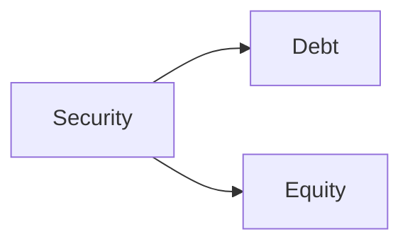
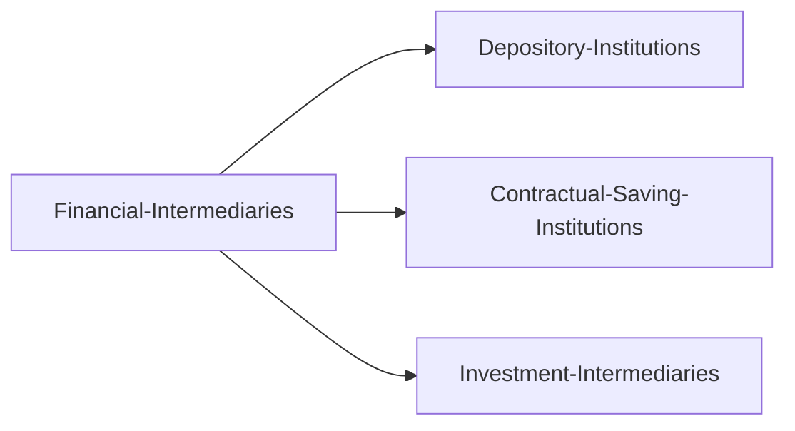
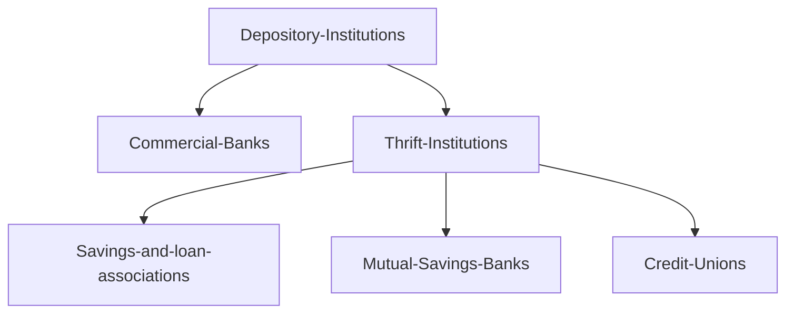

**This series of articles are based on *"The Economics of Money, Banking & Financial Markets, Ninth Edition"* by Mishkin.**

# Fiancial System

## Financial Markets

Financial markets perform the essential economic function of channeling funds from households, firms, and governments that have saved surlus funds by spending less than their income to those that have a shortage of funds because they wish to spend more than their income.

In direct finance, borrowers borrow funds directly from lenders in financial markets by selling them securities (=financial instruments), which are claims on the borrower's future income (debt) or assets (equity).

Why are financial markets important?

- Financial markets are critical for producing an efficient allocation of capital, which contributes to higher production and efficiency for the overall economy.
- Well-functioning financial markets also directly improve the well-being of consumers by allowing them to time their purchases better, making the economic welfare better.

### Structure of Financial Markets

A firm or an individual can obtain funds in a financial market in two ways.

#### Debt and Equity Markets

**The most common method is to issue a debt instrument**, such as a bond or a mortgage, which is a contractual aggreement by the borrower to pay the holder of the instrument fixed dollar amounts at regular intervals until a specified date, when a final payment is made.

The maturity of a debt instrument is the number of years until that instrument's expiration date.

A debt instrument is short-term if its maturity is less than a year and long-term if its maturity is ten years or longer. Debt instruments with a maturity between one and ten years are said to be intermediate-term.

**The second method of raising funds is by issuing equities**, such as common stock, which are claims to share in the net income (income after expenses and texes) and the assets of a business.

Equities often make periodic payments (dividends) to their holders and are considered long-term securities becasue they have ***no maturity date***. Besides,owning stock means that you own a portion of the firm and thus have the right to ***vote on issues important to firm and to elect its directors***.

The main disadvantage of owning a corporation's equities rather than its debt is that an equity holder is a ***residual claimant***, which means that the corporation must pay all its debt holders before it pays its equity holders. The advantage of holding equities is that equity holders benefit directly from any increases in the corporation's profitability or asset value because equities confer ownership rights on the equity holders.

Although the average person is more aware of the stock market than any other financial market, the size of debt market is often substantially larger than the size of the equities market. 

#### Primary and Secondary Markets 

- A primary market is a financial market in which new issues of a security , such as a bond or a stock (both debt and securities), aresold to initial buyers by the corporation or government agency borrowing the the funds.

- A secondary market is a financial market in which securities that have been previously issued can be resold.

The primary markets for securities are not well known to the public because the selling of securities to initial buyers often takes place behind closed doors. Animporatnt financial institution that assist in the initial sale of securities in the primary market is the ***investment bank***. It does this by underwriting securities: It guarantees a price for a corporation's securities and then sells them to the public.

NASDAQ (National Association of Securities Dealers Automated Quotation System) and The New York Stock Exchange are both examples of stock secondary markets.

Other examples of secondary markets are *foreign exchange markets, future markets, and options markets.*

When an individual buys a security in the secondary market, the person who has sold the security receives money in exchange for the security, but the corporation that issued the security acquires no new funds——a corporation acquires new funds only when its securities are first sold in the primary market.

Secondary markets serve two important functions,

- They make it easier and quicker to sell these financial instruments to raise cash——they make the financial instruments more liquid and desirable.

- They determine the price of the security that the issuing firm sells in the primary market——the investors who buy securities in the primary market will pay the issuing corporation ***no more than the price they think the secondary market will set for this security to make profits.***

#### Exchanges and Over-the-Counter Markets

*Brokers* are agents of investors who match buyers with sellers of securities; *dealers* link buyers and sellers by buying and selling securities at stated prices.

- Exchanges, where buyers and sellers of securities (or their agents or brokers) meet in one central location to conduct trades. Examples: The New York Stock Exchange for stocks and the Chicago Board of Trade for commodities.

- OTC market, where dealers at different locations who have an inventory of securities stand ready to buy and sell securities "over the counter" to anyone who comes to them and is willing to accept their prices. The U.S. government bond market is an example.

#### Money and Capital Markets

- The money market is a financial market in which only short-term ***debt*** instruments (generally those with original maturity of less than one year) are traded.

- The capital market is the market in which ***longer-term debt*** (generally those with original maturity of one year or greater) and ***equity*** instruments are traded.

Corporations and banks actively use the money market to earn interest on surplus funds that they expect to have only temporarily. Capital market securities are often held by financial intermediaries such as insurance companies and pension funds.

### Financial Market Instruments

#### Money Market Instruments

- United States Treasury Bills (debt). Sold by government at a discount, pay a pre-set amount at maturity and have no nominal interest, held mainly by banks.

- Negotiable Bank Certificates of Deposit (debt). Sold by a bank to depositors that pays annual interestof a given amount and at maturity pays back the original purchase price.

- Commercial Paper (debt). Issued by large banks and well-known corporations such as Microsoft.

- Repurchase Aggrements (debt, short-sterm loans). Usually with a maturity of less than two weeks for which Treasury bills serve as collateral. A large corpoation may have idle funds in its bank account, which it would like to lend for a week to the bank. The corporation uses idle funds to buy Treasury bills from a bank, which agrees to repurchase them the next week at a price slightly above the original purchase price.

- Federal (Fed) Funds (debt, overnight loans). Between banks of their deposits at the Federal Reserve because some banks may find it does not have enough deposits at the Fed to meet the amount required by regulators. It can then borrow these deposits from another bank, which transfers them to the borrowing bank using the Fed's wire transfer system.

#### Capital Market Instruments

- Stocks (equity) are equity calims on the net income and assets of a corporation. Compared with the huge value in the market, the amount of new stock issues in any given year is typically quite small.

- Mortgages (debt) are loans to households or firms to purchase housing, land, or other real structures where the structure or land itself serves as collateral for the loans. The mortgage market is the largest debt market in the U.S. Savings and loan associations, mutual savings banks and commercial banks have been the primary lenders in the residential mortgage markets.

- Corporate Bonds (debt) are issued by corporations with very strong credit ratings. The corporate bond sends the holder an interest payment twice a year and pays off the face value when the bond matures. The principal buyers are life insurance companies, pension funds and households.

- U.S. Government Securities (debt) are issued by the U.S. Treasury to finance the deficits of the federal government; held by the Federal Reserve, banks, households and foreigners.

- U.S. Government Agency Securities (debt) are issued by various government agencies to finance such items as mortgages, farm loans or power generating equipment. Held by similar parties above.

- State and Local Government Bonds (debt), also called municipal bonds, are issued by state and loocal governments to finance expenditures on schools, roads and other programs. Interest payments are exempt from federal income tax. Commercial banks, wealthy individuals and insurance companies are the biggest buyers of these securities.

- Comsumer and Bank Commercial Loans (debt). Loans from banks or finance companies to consumers and businesses.

## Financial Intermediaries

Funds can move from lenders to borrowers by a second route (indirect finance) because it involves a financial intermediary that stands between. The process of indirect finance using financial intermediaries, called financial intermediation, is the *primary route* for moving funds from lenders to borrowers.

### Imporatance of Financial Intermediaries

Why are financial intermediaries a far more important source of financing for corporations than securities markets?

#### Transaction Costs

Transaction costs are the time and money spent in carrying out financial transactions. For small savers and borrowers the transaction costs might outweigh the profits brought by such lending and borrowing and deter them from the benefit of finance.

Financial intermediaries can substantially reduce transaction costs because ***they have developed expertise in lowering them***; and  because ***their large size allows them to take the advantage of economies of scale***.

In addition, a financial intermediary's low transaction costs mean that it can provide its coustomers with ***liquidity services***, services that make it easier for customers to conduct transactions  anytime while still enjoy the interest.

#### Risk Sharing

Financial intermediaries also can help reduce the exposure of investors to risks through risk sharing: *They create and sell assets with risk characteristics that people are comfortable with, and the intermediaries then use the funds they acquire by selling these assets to purchase other assets that may have far more risk.* This process if risk sharing is also sometimes referred to as ***asset transformation*** because in a sense, risky assets are turned into safer assets for investors.

Financial intermediaries also promote risk sharing by helping individuals to diversify and thereby lower the amount of risk to which they are exposed. ***Diversification*** entails *investing in a collection (portfolio) of assets whose returns do not always move together, with the result that overall risk is lower than for individual assets*

#### Information Costs

In financial markets, one party often does not know enough about the other party to make accurate decisions. The inequality is called **asymmetric information**.

***Adverse selection*** is the problem created by asymmetric information **before** the transaction occurs. Adverse selection occurs when *the potential borrowers who are the most likely to produce an undesirable (adverse) outcome are the ones who most actively seek out a loan and are thus most likely to be selected.* Because adverse selection makes it more likely that loans might be made to bad credit risks, lenders may decide not to make any loans even though there are good credit risks in the marketplace.

***Moral hazard*** is the problem created by asymmetric information **after** the transaction occurs. Moral hazard is the risk that the borrower might engage in activities that are undersirable from the lender's point of view and lower the probability that the loan will be repaid.

However, with financial intermediaries in the economy, small savers can provide their funds to the financial markets by lending these funds to a trustworthy intermediary which are better equipped than individuals to screen out bad credit risks from good ones, thereby reducing losses due to asymmertic information.

As we have seen, financial intermediaries play an important role in the economy because they provide economies of scale and liquidity services, promote risk sharing, and solve asymmetric information problems, thereby allowing small savers and borrowers to benefit from the existence of financial markets.

### Classification of Financial Intermediaries

#### Depository Institutions

Depository institutions (=banks) are financial intermediaries that accept deposits from individuals and institutions and make loans.These institutions include *commercial banks* and the so-called *thrift institutions*.

- **Commercial Banks** raise funds primarily by *issuing checkable deposits (deposits on which checks can written), savings deposits (deposits that are payable on demand but no checks can be written) and time deposits (deposits with fixed terms to maturity)* and then *use these funds to make commercial, consumer, and mortgage loans and to buy U.S. government securities and municipal bonds*. Theya are the largest financial intermediary and have the most diversified portfolios of assets.

- **Savings and Loan Associations (S&Ls) and Mutual Savings Banks** obtain funds primarily through savings deposits and time and checkable deposits. Before they mainly made mortgage loans but over time they are more like commercial banks.

- **Credit Unions** are typically small cooperative lending institutions organized around a particular group. They acquire funds from deposits called *shares* and primarily make consumer loans.

#### Contractual Savings Institutions

Contractual savings institutions, such as insurance companies and pension funds, are financial intermediaries that acquire funds at periodic inntervals on a contractual basis.

- **Life Insurance Companies** insure people against financial hazards following a death and sell annuities (annual income payments upon retirement). They acquirefunds from the premiums that people pay to keep their policies in force and use them mainly to buy corporate bonds and mortgages.

- **Fire and Casualty Insurance Companies** insure their policyholders against loss from theft, fire, and accidents. They also receive funds through premiums but buy assets with more liquidity such as municipal bonds, corporate bonds, stocks and the U.S. government securities due to a greater possibility of loss of funds if major disasters occur.

- **Pension Funds and Government Retirement Funds**
Private pension funds and state and local retirement funds provide retirement income in the form of annuities to employees who are covered by a pension plan. Funds are acquired by contributions from employers and from employees, who either have a contribution automatically deducted from their paychecks or contribute voluntarily. The largest asset holdings of pension funds are corporate bonds and stocks.

#### Investment Intermediaries

- **Finance companies** raise funds by selling commercial paper and by issuing stocks and bonds. They lend these funds to consumers, who make purchases of such items as furniture, automobiles, and home improvements, and to small businesses.

- **Mutual funds** acquire funds by selling ahres to many individuals and use the proceeds to purchase diversified portfolios of stocks and bonds.

- **Money market mutual funds** have the characteristics of a mutual fund but also function to sime extent as a depository institution because they offer deposit-type accounts.

- **Investment banks** is a different type of intermediary that helps a corporation issue securities. First it advises the corporation on which type of securities to issue (stocks or bonds); then it helps sell (underwrite) the securities by purchasing them from the corporation at a predetermined price and reselling them in the market. Investment banks also act as deal makers and earn enormous fees by helping corporations acquire other companies through mergers or acquisitions.

## Regulation of the Financial System

**WHY**

### Increasing Information Available to Investors

Government regulation can reduce adverse selection and moral hazard problems in financial markets and increase their efficiency by increasing the amount of information available to investors.

### Ensuring the Soundness of Financial Intermediaries

Asymmetric information can lead to the widespread collapse of financial intermediaries, referred to as a financial panic. Because providers of funds to financial intermediaries may not be able to assess whether the institutions holding their funds are sound, if they have doubts about the overall health of financial iutermediaries, they may want to pull their funds out of both sound and unsound institutions. The possible outcome is a financial panic that produces large losses for the p ublic and causes serious damage to the economy. To protect the public and the economy from financial panics, the governmenthas implemented six types of regulations.

- **Restrictions on Entry**

- **Disclosure**

- **Restrictions on Assets and Activities**

- **Deposit Insurance**

- **Limits on Competition**

- **Restrictions on Interest Rates**
